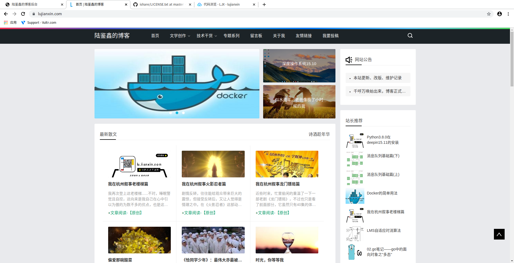
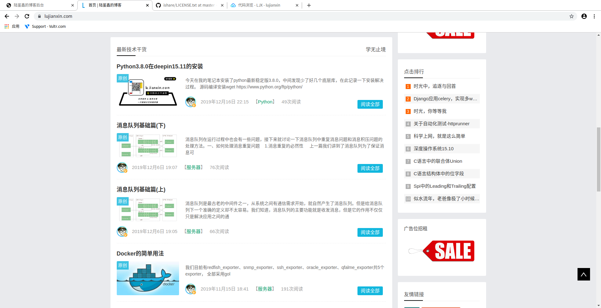
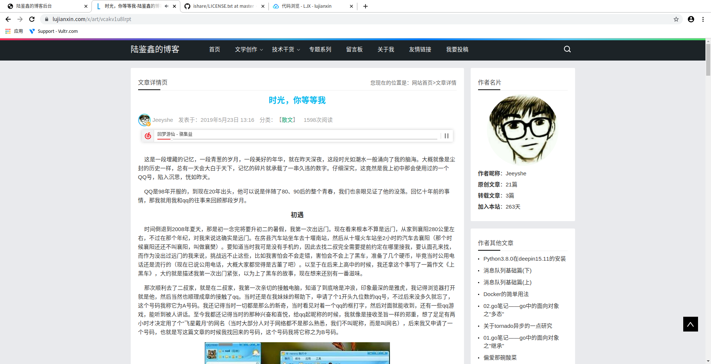
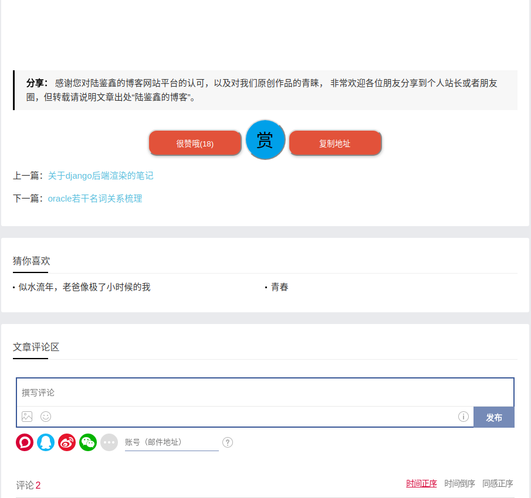
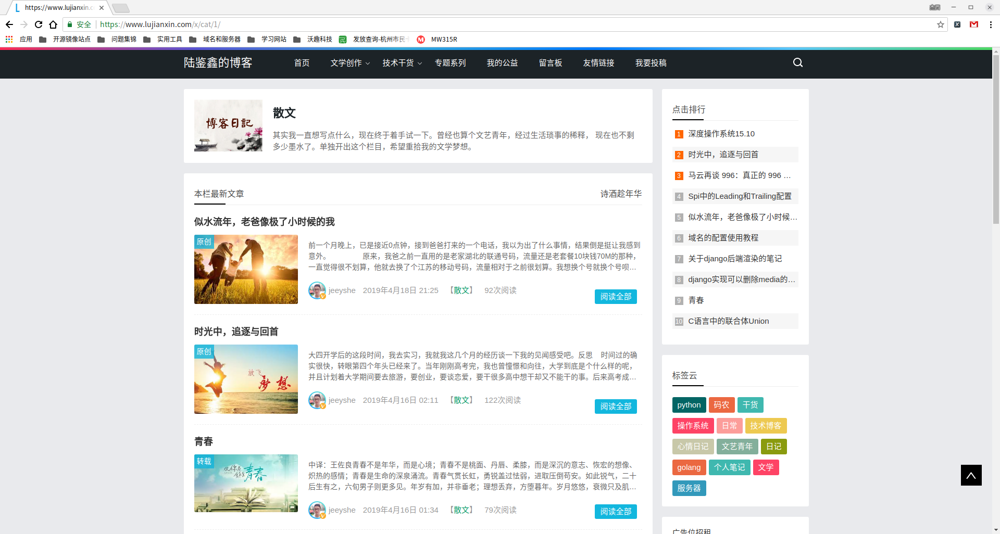
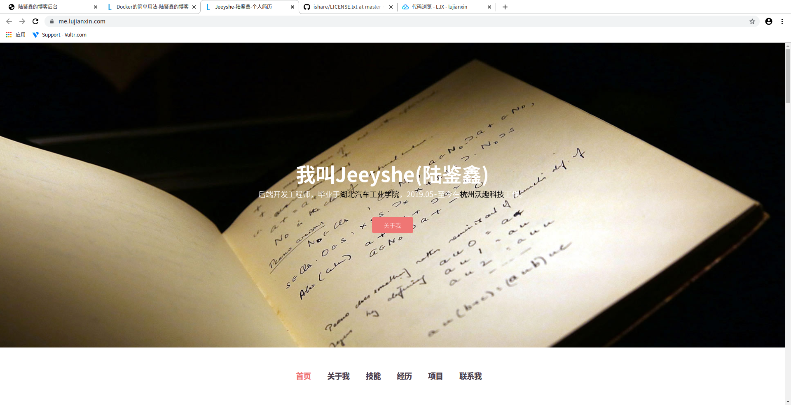
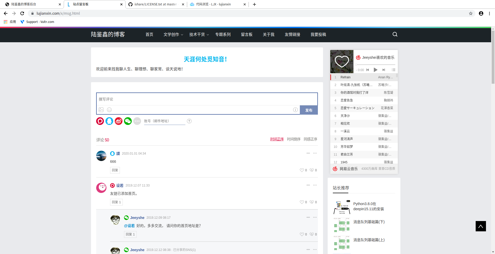
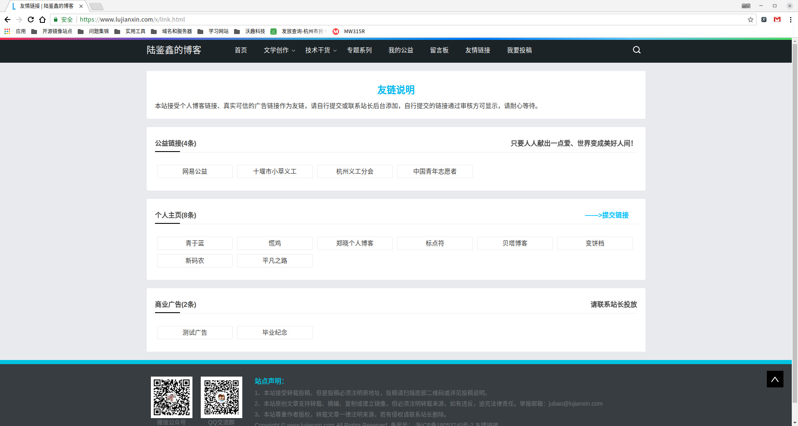
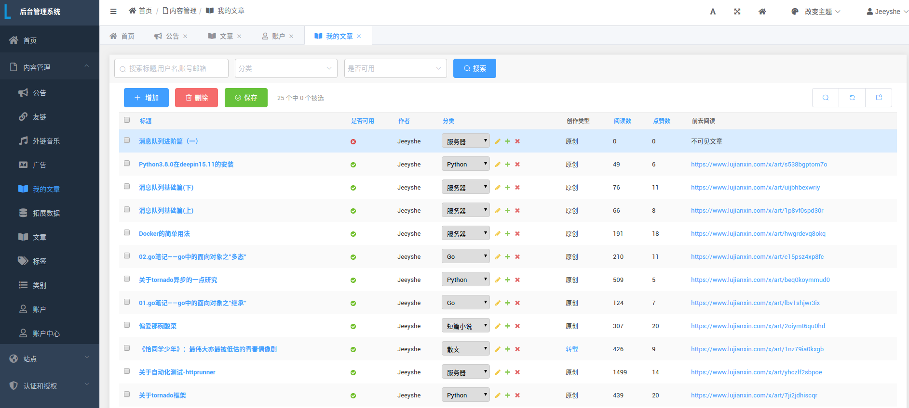
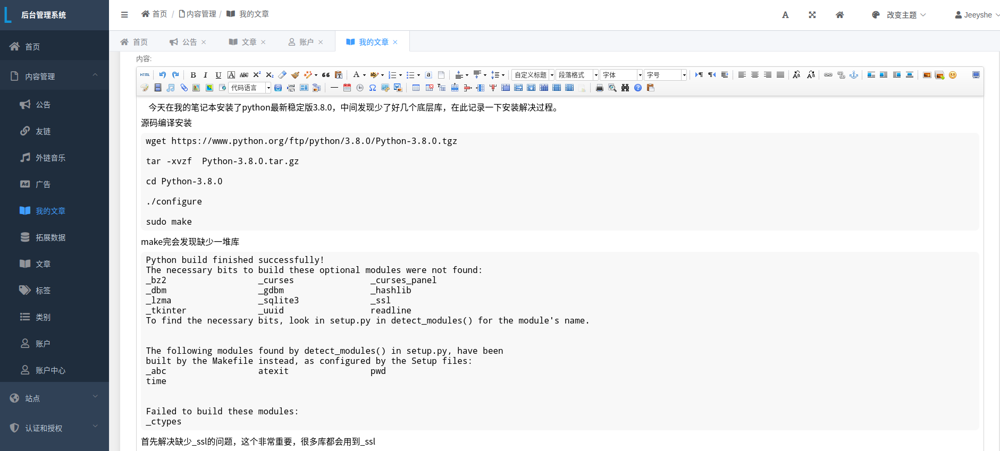

### 个人博客项目

---

> 思来想去, 我还是从网上淘了一个博客前端模板: [今夕何夕](https://www.yangqq.com), 我打算自己做后端, 毕竟前端对我来说很头痛.
感谢杨青姐的前端模板！

- 开发: 2019年03月08日 ~ 2019年04月08日
- 当前版本: `0.1.4-dev`
- 上线: [https://www.lujianxin.com](https://www.lujianxin.com)

### 使用技术:

---
- 线上环境 python>=3.8.0
- django + celery 后端框架
- nginx + uwsgi 项目部署
- mysql + redis 数据库
- 现成的前端模板 + simpleui后台管理系统

### 概览

- **首页**： 轮播图、最新散文、最新技术博客

- **详情页**： 文章详情、评论区、猜你喜欢

- **归档页**： 按照类别或标签

- **关于我**： 个人信息展示

- **留言板**： 来必力评论插件

- **友链页**： 公益类、个人类、商业类、自主提交链接

- **后台管理系统**: 文章列表页

- **编辑器**: 撰写文章

- 后续更新~
